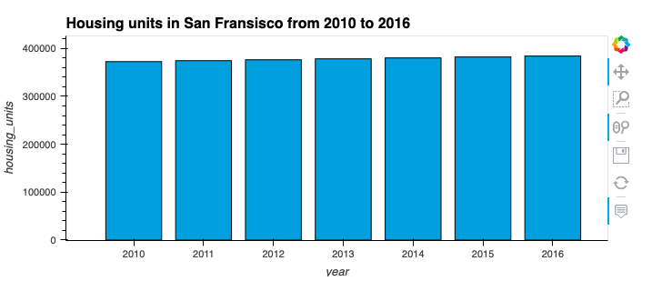
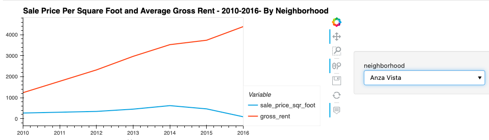
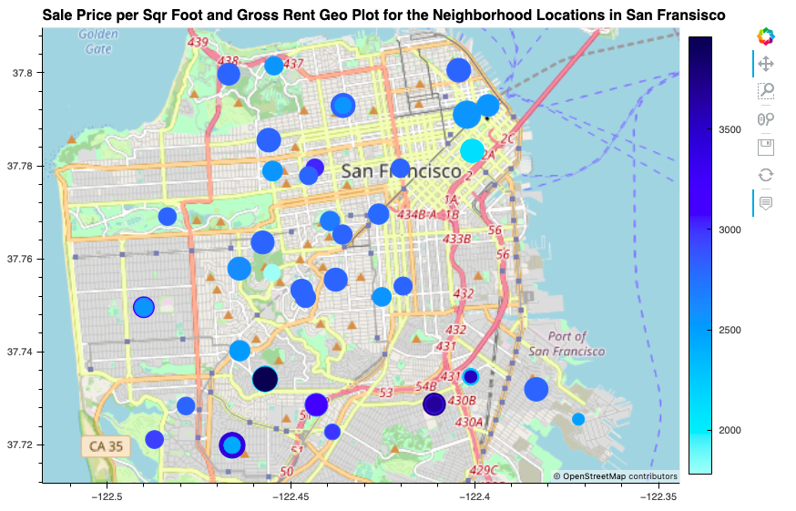

# Housing_Rental_Analysis

## Overview 
**Proptech** company was planning it's one-click service, an instant service for people to buy and rent their properties but first they wanted to have a trial of this offering by exploring real-estate market in San Fransisco. As a Data Analyst at Proptech, our task was to perform Data Exploration and Visualization using PyViz, for properties in the San Francisco market to find ones that are viable investment opportunities.

### Files used

* [Houing Rental Analysis File](san_francisco_housing.ipynb) : notebook is used to visualize and analyze the real-estate data

* [`neighbourhoods_coordinates` CSV File](Resources/neighbourhoods_coordinates.csv)

* [`sfo_neighbourhoods_census_data` CSV File](Starter_Code/Resources/sfo_neighbourhoods_census_data.csv)

---
### Technology Used

* Jupyter Notebook
* Pandas
* [PyViz](https://examples.pyviz.org/)- hvPlot & GeoViews for interactive Visualization

### Analysis Summary

Based on the visualizations that we created  during our analysis, we observed a trend in San Fransisco real-estate market over the years, where Sales price per square foot were seen fluctualting(increasing and falling) but Gross rent was observed to be increasing consistently along with housing units.
As per our analysis, one-click service offered by Proptech is hassle-free investment oppurtunity for people who are looking to explore real-estate and expand their long-term financial returns. For short-term this is not a good oppurtunity as average sale-price is observed to be falling over the years and can be risky.

Below are the screenshots of interactive Visualizations that we created during our analysis: 

##### Plot for Housing Units per Year

##### Plot for Average Sale Prices per Square Foot

##### Plot for Average Sale Prices by Neighbourhood

##### Neighborhood Map

